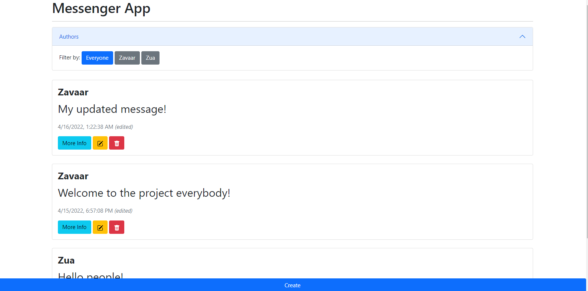

## Project 4 - Full-stack Messaging Project

This project demonstrates how a REST API (backend) works with the frontend.



* Requirements
  1. nodejs
  2. node package manager (NPM)
    - express
    - body-parser
    - node-json-db

1. First, initialize a node project in an empty folder:
```sh
npm init -y
```

2. Then, do:
```sh
npm install express body-parser node-json-db
```

3. make sure `database.json` starts off with:
```json
{"messages": []}
```